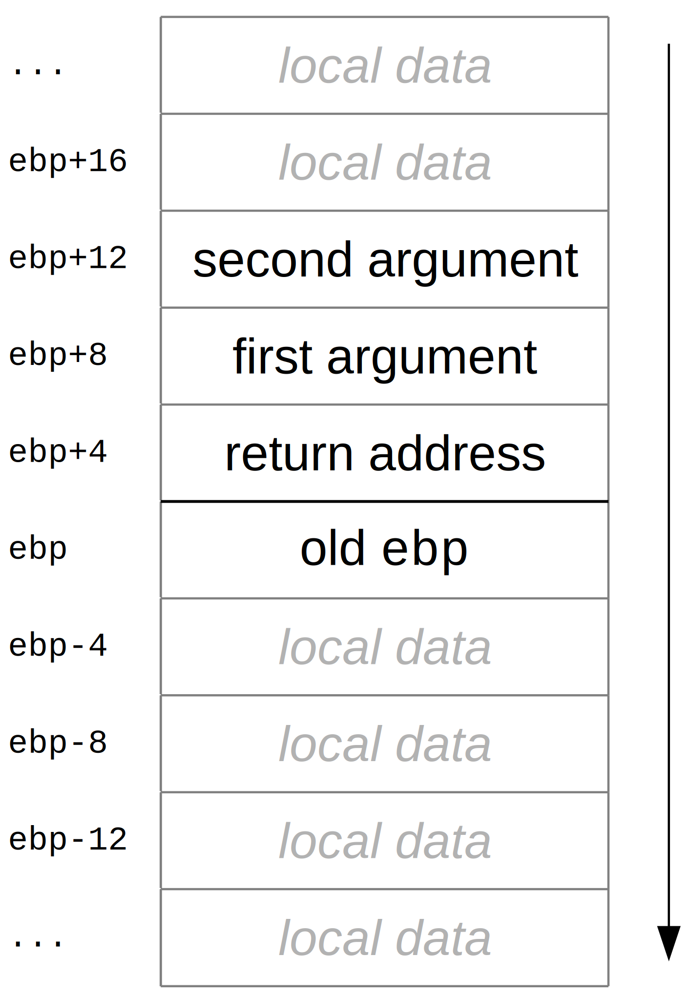

General Instructions
====================

## Addition and Subtraction

### `add a, b`

`a += b`

`a` and `b` can't both be memory.

### `sub a, b`

`a -= b`

`a` and `b` can't both be memory.

### `inc a`

`a++`

This command does not raise `CF` flag.

### `dec a`

`a--`

This command does not raise `CF` flag.

### `neg a`

`a = -a`

### `adc a, b`

`a += b + CF`

This command is generally used for qwords addition:
```
; calculate u+v
; u in (edx:eax), v in (ebx:ecx)
add eax, ecx
adc edx, ebx
```

`a` and `b` can't both be memory.

### `sbb a, b`

`a -= b + CF`

`a` and `b` can't both be memory.

This command is generally used for qwords subtraction:
```
; calculate u-v
; u in (edx:eax), v in (ebx:ecx)
sub eax, ecx
sbb edx, ebx
```

## Multiplication and Division

### `mul a`

Multiplier type | Operation performed
--------------- | -------------------
`byte` | `ax = al * a`
`word` | `(dx:ax) = ax * a`
`dword` | `(edx:eax) = eax * a`

`mul` multiplies unsigned numbers.

### `imul a`

Multiplier type | Operation performed
--------------- | -------------------
`byte` | `ax = al * a`
`word` | `(dx:ax) = ax * a`
`dword` | `(edx:eax) = eax * a`

`imul` multiplies signed numbers.

### `imul a, b`

`a *= b`

`a` and `b` have to be of same type.

This two-operand version of `imul` works both for signed and unsigned numbers.

### `imul a, b, c`

`a = b * c`

`c` has to be a constant, `a` and `b` have to be of same type.

This three-operand version of `imul` works both for signed and unsigned numbers.

### `div a`

Divider type | Operation performed
------------ | -------------------
`byte` | `al = ax / a` <br> `ah = ax % a`
`word` | `ax = (dx:ax) / a` <br> `dx = (dx:ax) % a`
`dword` | `eax = (edx:eax) / a` <br> `edx = (edx:eax) % a`

`div` operates with unsigned numbers.

*Warning:* before performing division with `word` or `byte` types
be sure to convert registers (`ax` or `eax`) to appropriate types.

### `idiv a`

Divider type | Operation performed
------------ | -------------------
`byte` | `al = ax / a` <br> `ah = ax % a`
`word` | `ax = (dx:ax) / a` <br> `dx = (dx:ax) % a`
`dword` | `eax = (edx:eax) / a` <br> `edx = (edx:eax) % a`

`idiv` operates with signed numbers.

*Warning:* before performing division with `word` or `byte` types
be sure to convert registers (`ax` or `eax`) to appropriate types.

### `lea a, [address]`

`lea` calculates an `address` expression and writes it back to `a`.

`address` is an expression formatted like this:
`base + index * scale + displacement`. `base` is a register,
`index` is any register except `esp`, `scale` is a number
from {0, 1, 2, 4, 8}, `displacement` is an arithmetic expression.
The order is not important, and it's even possible to put different
parts of `displacement` to different places. While each
of the three summands can be absent, it is not possible to use
several summands of the same type (use several `lea` instructions
in a row for that).


## Data Transfer and Size Conversion

### `mov a, b`

`a = b`

`a` and `b` can't both be memory.

### `xchg a, b`

`a, b = b, a`

A fast way to exchange two numbers.

`a` and `b` can't both be memory.

### `movzx a, b`

`a = b`

`a` has to be longer than `b`. The remaining space will be filled with zeroes.

`a` and `b` can't both be memory.

### `movsx a, b`

`a = b`

`a` has to be longer than `b`. The remaining space will be filled with with the first bit
of `a`, which denotes the sign for signed numbers.

`a` and `b` can't both be memory.

### `cdq`

Equivalent to:
```
mov edx, eax
sar edx, 31
```

This instruction is generally used to convert dwords to qwords before performing
signed division.

### `cwd`

Equivalent to:
```
mov dx, ax
sar dx, 15
```

This instruction is generally used to convert words to dwords before performing
signed division.

### `cbw`

Equivalent to:
```
movsx ax, al
```

This instruction is generally used to convert bytes to words before performing
signed division.

### `cwde`

Equivalent to:
```
movsx eax, ax
```


## Comparison and Testing

### `cmp a, b`

This instruction is mostly the same as `sub a, b`, except it doesn't change `a`.
Since it sets flags just as `sub a, b` would, it is commonly used to compare two
numbers, either signed or unsigned.

`a` and `b` can't both be memory.

### `test a, b`

This instruction is mostly the same as `and a, b`, except it doesn't change `a`.
Since it sets flags just as `and a, b` would, it is commonly used to check if a
number has a specific bit pattern. Another possible use is to test number by itself
(`test a, a`) to check if it equals zero.

`a` and `b` can't both be memory.


## Execution Control and Stack Management

### `jmp label`

Continue the execution from the instruction that's labelled `label`.

### `call label`

Push the address of the next instruction onto the stack, then `jmp label`.

This instruction is usually used to call procedures and functions, since the
address it puts on stack can be used as return address after the callee exits.

### `ret`

Pop an address from the stack and `jmp` there.

This instruction is usually used together with `call` to organize function calling.

### `ret size`

Pop an address from the stack and `jmp` there, then `add esp, size`.

This instruction is usually used together with `call` to organize function calling
in cases where the callee is responsible for stack cleanup.

### `push a`

Roughly equivalent to:
```
sub esp, sizeof(a)
mov dword[esp], a
```

This instruction pushes a value onto stack, decrementing stack pointer
by its size. Unlike the code above, it can work with memory locations
and does not affect flags.

### `pop a`

Roughly equivalent to:
```
mov a, dword[esp]
add esp, sizeof(a)
```

This instruction pops a value from stack, incrementing stack pointer
by its size. Unlike the code above, it can work with memory locations
and does not affect flags. Note that the data is not erased or destroyed
in any way.

*Note:* to pop a value without storing it, use `add esp, sizeof(a)`.

### `leave`

Equivalent to:
```
mov esp, ebp
pop ebp
```

This instruction is usually used for restoring the stack state at the end of a
function or a procedure.

### `pushad`

Roughly equivalent to:
```
mov dword[esp -  4], eax
mov dword[esp -  8], ecx
mov dword[esp - 12], edx
mov dword[esp - 16], ebx
mov dword[esp - 20], esp
mov dword[esp - 24], ebp
mov dword[esp - 28], esi
mov dword[esp - 32], edi
sub esp, 32
```

This instruction pushes nearly all registers to the stack. Unlike
the code above it does not affect flags.

### `popad`

Roughly equivalent to:
```
add esp, 32
mov eax, dword[esp -  4]
mov ecx, dword[esp -  8]
mov edx, dword[esp - 12]
mov ebx, dword[esp - 16]
; do not mov esp, dword[esp - 20]
mov ebp, dword[esp - 24]
mov esi, dword[esp - 28]
mov edi, dword[esp - 32]
```

This instruction pops nearly all registers from the stack. Unlike
the code above it does not affect flags.

## Bitwise Operations

### `and a, b`

`a &= b`

`a` and `b` can't both be memory.

### `or a, b`

`a |= b`

`a` and `b` can't both be memory.

### `xor a, b`

`a ^= b`

`a` and `b` can't both be memory.

This instruction is often used in form of `xor a, a` in order to set `a` to zero.
It is shorter than a simple `mov a, 0` when translated to the machine code.

### `not a`

`a = ~a`

`~a` equals `(-a-1)` for signed numbers and `(maxval - a)` for unsigned ones.

### `shl a, b`

`a <<= b % 32`

`b` can be either a constant or the `cl` register.

`CF` flag is set to the last bit that was shifted out. All the shifted in bits are
filled with zeroes. If `(b % 32)` equals `1`, `OF` is set to `CF^SF`.

*Note:* this is the same as the `sal` instruction.

### `sal a, b`

`a <<= b % 32`

`b` can be either a constant or the `cl` register.

`CF` flag is set to the last bit that was shifted out. All the shifted in bits are
filled with zeroes. If `(b % 32)` equals `1`, `OF` is set to `CF^SF`.

*Note:* this is the same as the `shl` instruction.

### `shr a, b`

`a >>= b % 32`

`b` can be either a constant or the `cl` register.

`CF` flag is set to the last bit that was shifted out. All the shifted in bits are
filled with zeroes.

### `sar a, b`

`a >>= b % 32`

`b` can be either a constant or the `cl` register.

`CF` flag is set to the last bit that was shifted out. All the shifted in bits are
filled with the sign bit of `a`.

## Conditionals

### `jCC label`

Perform `jmp label` if the condition holds true.

Some conditions are only flag-based and some make sense if executed after `cmp` instruction.

The following table specifies possible meanings of using conditional jumps
after `cmp a, b` instruction:

CC | Alt CC | Meaning | Signity | Flags
:-:|:------:|:-------:|:-------:|:-----
`e`  | `z`  | `a == b` | Both | `ZF`
`ne` | `nz` | `a != b` | Both | `!ZF`
`ge` | `nl` | `a >= b` | Signed | `SF == OF`
`g` | `nle` | `a > b` | Signed | `SF == OF` and `!ZF`
`le` | `ng` | `a <= b` | Signed | `SF != OF` or `ZF`
`l` | `nge` | `a < b` | Signed | `SF != OF`
`ae` | `nb` | `a >= b` | Unsigned | `!CF`
`a` | `nbe` | `a > b` | Unsigned | `!CF` and `!ZF`
`be` | `na` | `a <= b` | Unsigned | `CF` or `ZF`
`b` | `nae` | `a < b` | Unsigned | `CF`

Flag-based conditions:

CC | Flags
:--:|:-----:
`z` | `ZF`
`c` | `CF`
`o` | `OF`
`s` | `SF`
`p` | `PF`
`nz` | `!ZF`
`nc` | `!CF`
`no` | `!OF`
`ns` | `!SF`
`np` | `!PF`

### `jecxz label`

Equivalent to:

```
test ecx, ecx
jz label
```

### `loop label`

Equivalent to:
```
dec ecx
jnz label
```

This instruction is usually used for implementing loops with post-condition where
`ecx` is used as loop counter.

### `setCC a`

`a = CC ? 1 : 0`

`a` has to be a single byte.

This instruction sets `a` to `1` if the condition holds true and to zero otherwise.

Some conditions are only flag-based and some make sense if executed after `cmp` instruction.

The following table specifies possible meanings of using conditional jumps
after `cmp a, b` instruction:

CC | Alt CC | Meaning | Signity | Flags
:-:|:------:|:-------:|:-------:|:-----
`e`  | `z`  | `a == b` | Both | `ZF`
`ne` | `nz` | `a != b` | Both | `!ZF`
`ge` | `nl` | `a >= b` | Signed | `SF == OF`
`g` | `nle` | `a > b` | Signed | `SF == OF` and `!ZF`
`le` | `ng` | `a <= b` | Signed | `SF != OF` or `ZF`
`l` | `nge` | `a < b` | Signed | `SF != OF`
`ae` | `nb` | `a >= b` | Unsigned | `!CF`
`a` | `nbe` | `a > b` | Unsigned | `!CF` and `!ZF`
`be` | `na` | `a <= b` | Unsigned | `CF` or `ZF`
`b` | `nae` | `a < b` | Unsigned | `CF`

Flag-based conditions:

CC | Flags
:--:|:-----:
`z` | `ZF`
`c` | `CF`
`o` | `OF`
`s` | `SF`
`p` | `PF`
`nz` | `!ZF`
`nc` | `!CF`
`no` | `!OF`
`ns` | `!SF`
`np` | `!PF`

### `cmovCC a, b`

Perform `mov a, b` if the condition holds true.

`a` and `b` both have to be registers.

Some conditions are only flag-based and some make sense if executed after `cmp` instruction.

The following table specifies possible meanings of using conditional jumps
after `cmp a, b` instruction:

CC | Alt CC | Meaning | Signity | Flags
:-:|:------:|:-------:|:-------:|:-----
`e`  | `z`  | `a == b` | Both | `ZF`
`ne` | `nz` | `a != b` | Both | `!ZF`
`ge` | `nl` | `a >= b` | Signed | `SF == OF`
`g` | `nle` | `a > b` | Signed | `SF == OF` and `!ZF`
`le` | `ng` | `a <= b` | Signed | `SF != OF` or `ZF`
`l` | `nge` | `a < b` | Signed | `SF != OF`
`ae` | `nb` | `a >= b` | Unsigned | `!CF`
`a` | `nbe` | `a > b` | Unsigned | `!CF` and `!ZF`
`be` | `na` | `a <= b` | Unsigned | `CF` or `ZF`
`b` | `nae` | `a < b` | Unsigned | `CF`

Flag-based conditions:

CC | Flags
:--:|:-----:
`z` | `ZF`
`c` | `CF`
`o` | `OF`
`s` | `SF`
`p` | `PF`
`nz` | `!ZF`
`nc` | `!CF`
`no` | `!OF`
`ns` | `!SF`
`np` | `!PF`


Calling Conventions
===================

### cdecl

cdecl is a calling convention used by many C compilers.

Arguments are passed on the stack, in reverse order (the first argument goes last).
It is the caller who should clean the stack from arguments after the call. It can,
however, keep them if it needs them for some reason like making another function call
with the same or similar set of arguments.

The values of registers `eax`, `ecx` and `edx` ("caller-saved" registers) can be
changed by the callee while values of all the other registers ("callee-saved" registers,
including `ebp`) must be preserved. This is usually accomplished by pushing their
initial values on stack in the very start of the callee execution and poping them
back in the end.

The register `ebp` is commonly used as a pointer to the start of the current function's
frame (frame pointer), i.e., the part of the stack being used and controlled by the
current function. This allows for arguments and local variables to have constant (relative to `ebp`)
addresses regardless of number of items pushed onto the stack. Functions
usually start their execution by saving `ebp` value onto the stack, then resetting
it to point to the just-saved value, and then pushing all the other registers on top of it.

As an optimization (especially for small functions) it is allowed to omit saving and restoring
`ebp` and reference the stack relative to `esp`.

Floating-point registers `ST1`-`ST7` must be empty before function call and after exiting a function.
`ST0` must also be empty on call and on exit, if not used for returning a value.

To return a value that fits into a `dword`, function should leave it in `eax` before exiting.
Data types that require up to 8 bytes of memory can be returned in `edx:eax`, while longer
values should be returned "in memory". Floating-point numbers are returned in `ST0`.

The following image shows a typical stack structure during a call of a function that accepts
two arguments:



The following example demonstrates the use of the frame pointer to access arguments
and the idea of storing values of registers on the stack to preserve them:

```
; int max_item(int *arr, int len);
max_item:
    push ebp
    mov ebp, esp
    push ebx

    mov ebx, dword[ebp+8] ; ebx = arr
    mov eax, dword[ebx] ; res = arr[0]
    mov ecx, dword[ebp+12] ; ecx = len
.loop:
    dec ecx
    mov edx, dword[ebx + ecx*4] ; current item
    cmp edx, eax
    cmovg eax, edx
    jecxnz .loop

    pop ebx
    leave
    ret
```

This function is called like that:
```
push len
push arr
call max_item
add esp, 2*4 ; clean up the stack
; result in eax
```

It is possible to write a simpler version of this function which avoids using
frame pointer:

```
; int max_item(int *arr, int len);
max_item:
    mov eax, dword[esp+4]
    mov eax, dword[eax] ; res = arr[0]
    mov ecx, dword[esp+8] ; ecx = len
.loop:
    dec ecx
    mov edx, dword[esp+4]
    mov edx, dword[edx + ecx*4]
    cmp edx, eax
    cmovg eax, edx
    jecxnz .loop

    ret
```

Note that this function should be called in the exact same way, since the optimization
only changes function's internal behaviour, not its "public interface".

In the case of "in memory return" the caller should allocate the required amount of memory
and push a pointer to it onto the stack after all the arguments. The callee then should
leave its return value in that memory. The callee is also required to pop the pointer from
the stack, which is usually done with `ret 4`.

### fastcall

The fastcall convention is very similar to cdecl. The difference is that the first two
function arguments are not pushed onto the stack, but passed in `ecx` and `edx` registers,
respectively. This allows for simple functions to be shorter and operate faster.

For example, this is the function that subtracts two numbers:

```
diff:
    mov eax, ecx
    sub eax, edx
    ret
```

### stdcall

The stdcall convention is very similar to cdecl. The difference is that the callee is
responsible for cleaning up the stack, i.e. removing arguments. That leads to shorter
code, as with cdecl stack cleanup is performed everywhere a function is called.

For example, this is the function that subtracts two numbers:

```
diff:
    mov eax, dword[esp+4]
    sub eax, dword[esp+8]
    ret 8
```

String Instructions
===================

## Comparison

### `cmpsS`

```
cmp S[esi], S[edi]

if DF == 0:
    esi += sizeof(S)
    edi += sizeof(S)
else:
    esi -= sizeof(S)
    edi -= sizeof(S)
```

This instruction compares two chunks of data stored at memory addresses `esi` and `edi`,
sets appropriate flags, then changes `esi` and `edi` to point to the next chunks.

`S`| Meaning | `sizeof(S)`
:-:|---------|------------
B  | byte    | 1
W  | word    | 2
D  | dword   | 4

This instruction can be used with any repeating prefix.

### `scasS`

```
cmp register, S[edi]

if DF == 0:
    edi += sizeof(S)
else:
    edi -= sizeof(S)
```

This instruction compares the accumulator register with a chunk of data stored at memory
address `edi`, sets appropriate flags, then changes `edi` to point to the next chunk.

`S`| Meaning | `sizeof(S)` | Register used
:-:|---------|-------------|--------------
B  | byte  | 1 | `al`
W  | word  | 2 | `ax`
D  | dword | 4 | `eax`

This instruction can be used with any repeating prefix.

## Copying

### `movsS`

```
mov S[edi], S[esi]

if DF == 0:
    esi += sizeof(S)
    edi += sizeof(S)
else:
    esi -= sizeof(S)
    edi -= sizeof(S)
```

This instruction copies a chunk of data from memory addresses `esi` to `edi`, then
changes `esi` and `edi` to point to the next chunks.

`S`| Meaning | `sizeof(S)`
:-:|---------|------------
B  | byte    | 1
W  | word    | 2
D  | dword   | 4

This instruction can be used with the `rep` prefix.

### `stosS`

```
mov S[edi], register

if DF == 0:
    edi += sizeof(S)
else:
    edi -= sizeof(S)
```

This instruction stores the accumulator register value to the memory chunk at address
`edi`, then changes `edi` to point to the next chunk.

`S`| Meaning | `sizeof(S)` | Register used
:-:|---------|-------------|--------------
B  | byte  | 1 | `al`
W  | word  | 2 | `ax`
D  | dword | 4 | `eax`

This instruction can be used with the `rep` prefix.

### `lodsS`

```
mov register, S[esi]

if DF == 0:
    esi += sizeof(S)
else:
    esi -= sizeof(S)
```

This instruction loads the data stored in a chunk of memory at address `esi` to the
accumulator register, then changes `esi` to point to the next chunk.

`S`| Meaning | `sizeof(S)` | Register used
:-:|---------|-------------|--------------
B  | byte  | 1 | `al`
W  | word  | 2 | `ax`
D  | dword | 4 | `eax`

It doesn't make sense to use this instruction with any repeating prefix.

## Direction Changing

### `std`

`DF = 1`

### `cld`

`DF = 0`

## Prefixes

### `repRR`

```
for(; ecx != 0; ecx--)
{
    string_instruction();
    if(!condition)
        break;
}
```

Repeat the following string instruction while the condition is true, at most `ecx` times,
decrementing `ecx` each time.

RR | Condition
:-:|----------
   | ZF
 E | ZF
 Z | ZF
NE | !ZF
NZ | !ZF

Floating point instructions
===========================

## Transfers

### `fld a`

Push `a` onto FP-stack.

`a` can't be a register, `a` has to be a floating point number.

### `fild a`

Push `a` onto FP-stack.

`a` can't be a register, `a` has to be an integer.

### `fst a`

Copy the value from the top of the FP-stack to `a`.

`a` can't be a register.

### `fstp a`

Pops the value from the top of the FP-stack to `a`.

`a` can't be a register.

## Loading Constants

### `fldz`

Push `+0.0` onto the FP-stack.

### `fld1`

Push `+1.0` onto the FP-stack.

### `fldl2t`

Push `log2(10)` onto the FP-stack.

### `fldlg2`

Push `log10(2)` onto the FP-stack.

### `fldln2`

Push `log(2)` onto the FP-stack.

### `fldpi`

Push `pi` onto the FP-stack.

## Addition and Subtraction

### `fadd`

`ST1 += ST0`

### `faddp`

`ST1 += ST0` and remove `ST0` from the FP-stack.

### `fsub`

`ST1 -= ST0`

### `fsubp`

`ST1 -= ST0` and remove `ST0` from the FP-stack.

### `fsubr`

`ST1 = ST0 - ST1`

### `fsubrp`

`ST1 = ST0 - ST1` and remove `ST0` from the FP-stack.

### `fabs`

`ST0 = abs(ST0)`

### `fchs`

`ST0 = -ST0`


## Multiplication and Division

### `fmul`

`ST1 *= ST0`

### `fmulp`

`ST1 *= ST0` and remove `ST0` from the FP-stack.

### `fdiv`

`ST1 /= ST0`

### `fdivp`

`ST1 /= ST0` and remove `ST0` from the FP-stack.

### `fdivr`

`ST1 = ST0 / ST1`

### `fdivrp`

`ST1 = ST0 / ST1` and remove `ST0` from the FP-stack.

## Trigonometry

### `fsin`

`ST0 = sin(ST0)`

`ST0` is supposed to be in radians.

### `fcos`

`ST0 = cos(ST0)`

`ST0` is supposed to be in radians.

### `fsincos`

`ST0 = sin(ST0)` and push `cos(ST0)` onto the FP-stack.

`ST0` is supposed to be in radians.

### `fptan`

`ST0 = tan(ST0)` and `fld1`.

### `fpatan`

`ST1 = atan2(ST1, ST0)` and remove `ST0` from the FP-stack.

## Comparisons

### `fcom a`
 
Compares `ST0` with `a` and sets appropriate FPU flags.

`a` has to be a floating point memory value.

If either `a` or `ST0` is `NaN` an exception is raised.

### `fcomp a`

Compares `ST0` with `a`, sets appropriate FPU flags and pops `ST0`.

`a` has to be a floating point memory value.

If either `a` or `ST0` is `NaN` an exception is raised.

### `fcompp`

Compares `ST0` with `ST1`, sets appropriate FPU flags and pops `ST0` and `ST1`.

If either `ST1` or `ST0` is `NaN` an exception is raised.

### `fcomi a`
 
Compares `ST0` with `a` and sets appropriate CPU flags.

`a` has to be a floating point memory value.

If either `a` or `ST0` is `NaN` an exception is raised.

### `fcomip a`

Compares `ST0` with `a`, sets appropriate CPU flags and pops `ST0`.

`a` has to be a floating point memory value.

If either `a` or `ST0` is `NaN` an exception is raised.

### `fucom a`
 
Compares `ST0` with `a` and sets appropriate FPU flags.

`a` has to be a floating point memory value.

### `fucomp a`

Compares `ST0` with `a`, sets appropriate FPU flags and pops `ST0`.

`a` has to be a floating point memory value.

### `fucompp`

Compares `ST0` with `ST1`, sets appropriate FPU flags and pops `ST0` and `ST1`.

### `fucomi a`
 
Compares `ST0` with `a` and sets appropriate CPU flags.

`a` has to be a floating point memory value.

### `fucomip a`

Compares `ST0` with `a`, sets appropriate CPU flags and pops `ST0`.

`a` has to be a floating point memory value.

## Convertions to and from integers

### `fild a`

Converts `a` to a floating point number and pushes it onto the FP-stack.

`a` has to be a value in memory

### `fist a`

Converts `ST0` to integer by rounding it to the closest to `ST0` integer 
and writes it back to `a`

`a` has to be a value in memory

### `fistp a`

Converts `ST0` to integer by rounding it to the closest to `ST0` integer,
writes it back to `a` and pops `ST0` from the FP-stack.

`a` has to be a value in memory
